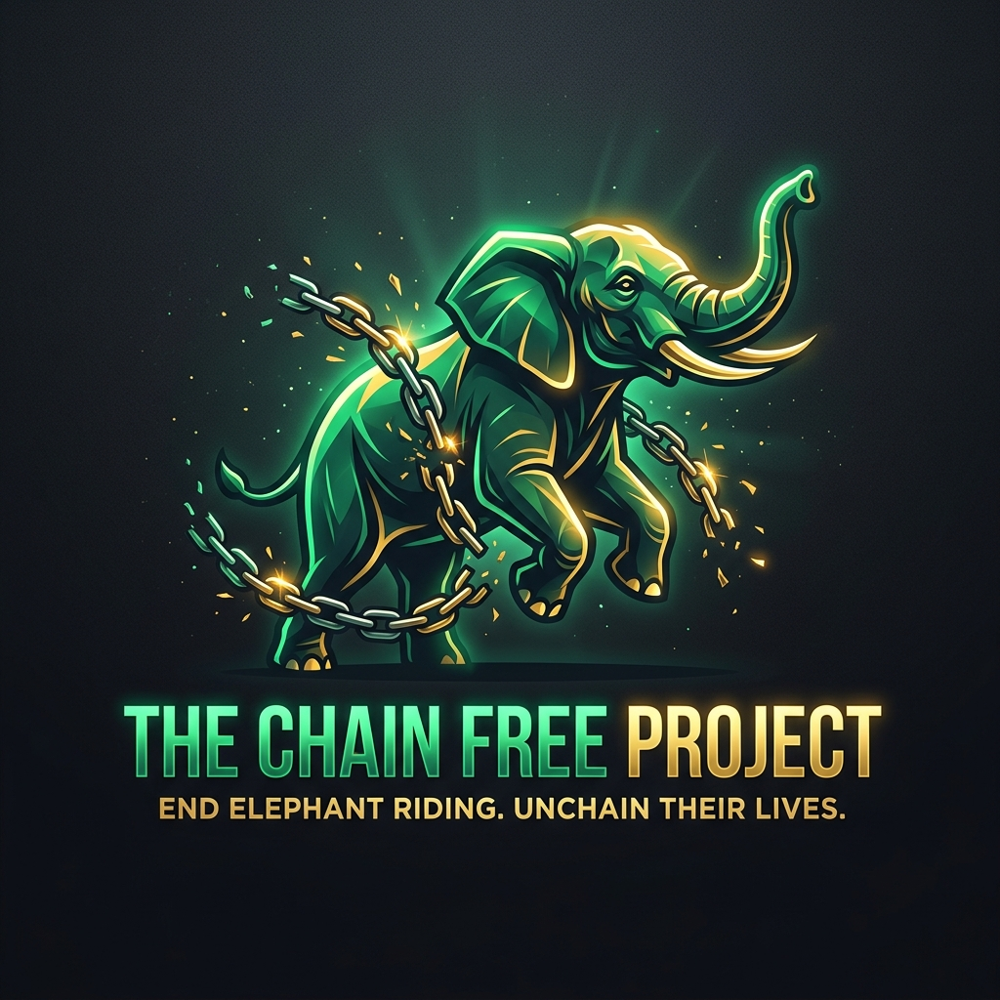

# The Chain Free Project 🐘

Welcome to the **Chain Free Project**, a campaign dedicated to ethical elephant welfare. This platform serves as a landing page to raise awareness, collect volunteer applications, and drive fundraising for the liberation of working elephants in Sauraha, Nepal.



## 🌟 Features
- **Stunning UI**: Premium glassmorphism design with a lush, dynamic jungle aesthetic.
- **Volunteer Booking**: A fully validated form to apply for volunteer programs or book ethical experiences.
- **Sanctuary Gallery**: A beautiful carousel showcasing rescued elephants in their natural habitats.
- **WhatsApp Integration**: A floating chat widget for instant communication.

## 🏗️ Architecture (Monorepo)
This repository is a monorepo containing two decoupled applications:
1. **Frontend**: Next.js (React 19, Tailwind CSS v4).
2. **Backend**: Laravel 13 (PHP 8.3 API).

## 🚀 Getting Started

### Option 1: Docker (Recommended)
You can run the entire stack (Database, Backend, Frontend) with a single command using Docker.
```bash
docker-compose up -d --build
```
- Frontend: `http://localhost:3000`
- Backend API: `http://localhost:8000`

*Note: You may need to run `docker-compose exec backend php artisan key:generate` and `php artisan migrate --seed` on first run.*

### Option 2: Local Development
If you prefer running the applications locally without Docker:
1. **Backend**: Navigate to `elephant-campaign-backend`, configure your `.env`, and run `php artisan serve`.
2. **Frontend**: Navigate to `elephant-campaign-frontend`, copy `.env.example` to `.env.local`, and run `npm run dev`.

## 🚢 Deployment
The project is configured for seamless deployment on platforms like [Railway](https://railway.app). 
- The backend utilizes `nixpacks.toml` to automatically install PHP 8.3 and run migrations.
- The frontend Next.js app builds natively out of the box.

## 🛡️ Testing
The Laravel backend is fully covered by automated Feature tests for the Volunteer API endpoint.
```bash
cd elephant-campaign-backend
php artisan test
```

## 🤝 Contributing
Feel free to open issues or submit pull requests. All contributions to elephant welfare are appreciated!
